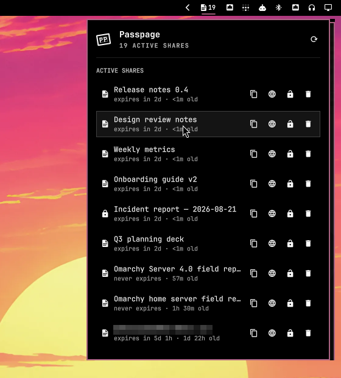

# Passpage for Omarchy

Your [passpage.space](https://passpage.space) shares in the Omarchy bar.



The bar shows a page glyph with the number of active shares. Click it for a
panel that lists every share with its expiry, passcode state and view count,
plus quick actions: copy link, open in browser, set / change / remove
passcode, delete. Shares expiring within 24 h are highlighted; expired but
not-yet-swept shares sit in a dimmed **Expired** section so you can delete
them early.

Publishing is intentionally not here — pages are published by agents or the
`passpage` CLI through the API. This plugin is for seeing and managing what
is live.

## Install

```bash
omarchy plugin add https://github.com/Zeus-Deus/passpage-omarchy-plugin --enable
```

Then give it an API key. Create one at passpage.space → Dashboard → API keys
and save it to `~/.config/passpage/key` (the same file the `passpage` CLI uses):

```bash
mkdir -p ~/.config/passpage && chmod 700 ~/.config/passpage
printf %s 'pp_…' > ~/.config/passpage/key && chmod 600 ~/.config/passpage/key
```

Mode `600` (or `400`) is required — the plugin refuses to read a key file
that group or others can access, or that is a symlink or not owned by you.

The panel watches that file and picks the key up without a restart. While it
is missing, unsafe (permissions/ownership), invalid, or rejected by the
server, the bar glyph shows a `!` badge and the panel says why.

### Dependencies

Everything is already present on a stock Omarchy install:

- `curl` — all API calls
- `perl` — guarded API-key reader (already installed as a dependency of `git`)
- `wl-copy` (wl-clipboard) — copy link
- `omarchy-launch-browser` — open share / dashboard

No background services, installers, elevated privileges, or remote builds.
The plugin never writes outside the shell's own `shell.json` settings (and
only when Omarchy asks it to).

## Usage

| Action | Mouse | Key |
|---|---|---|
| Copy link | click row or 󰆏 | `Enter` / `c` |
| Open in browser | 󰖟 | `o` |
| Set / change / remove passcode | 󰌿 / 󰌾 | `p` |
| Delete (with confirmation) | 󰆴 | `x` |
| Refresh | 󰑐 or middle-click the bar icon | `r` |
| Open passpage dashboard | — | `d` |

`j`/`k` or arrows move the cursor, `Esc` closes (or cancels an open editor /
dialog), `Tab` switches to the neighbouring bar panel.

Passcode editor: type and press `Enter` to set; leave it empty and press
`Enter` to remove an existing passcode.

IPC:

```bash
omarchy-shell passpage toggle | open | close | refresh | status
```

`status` returns JSON, e.g.
`{"loaded":true,"active":11,"expired":0,"expiringSoon":1,"error":"",
"keyMissing":false,"keyInvalid":false,"keyUnsafe":false}`.

## Configure

Settings live inline on the bar entry in `~/.config/omarchy/shell.json`
(Omarchy's plugin settings UI edits the same keys):

```json
{ "id": "space.passpage.shares", "refreshIntervalSec": 300 }
```

| Key | Default | Meaning |
|---|---|---|
| `refreshIntervalSec` | `300` | Background refresh of the bar count (30–3600). The panel always refreshes when opened. |
| `baseUrl` | `https://passpage.space` | Only for a self-hosted passpage. |

## Remove

```bash
omarchy plugin remove space.passpage.shares
```

This deletes the plugin folder and its bar entry. Your API key file
(`~/.config/passpage/key`) is yours and is left alone.

## Security notes

- The API key and any passcode you type are handed to `curl` through a config
  file on stdin — never on the command line, so they are not visible in `/proc`.
- curl runs with `-q` (never reads `~/.curlrc`) and `--globoff`, so no inherited
  option and no glob in a URL can redirect the request, weaken TLS, attach the
  key to another URL, or fan one request out to several hosts.
- `baseUrl` is validated to a single unambiguous http(s) endpoint — `https` is
  required unless the host is loopback, so credentials never cross the network
  in cleartext; userinfo, backslashes, controls, bidi/zero-width marks,
  whitespace, `?`/`#`, and curl URL globs are rejected. A blank value falls
  back to the default; any other unusable value fails closed (no request)
  rather than silently falling back to production. Brackets delimiting an
  IPv6 host are supported.
- Requests to loopback hosts never transit an `http_proxy`/`HTTPS_PROXY` from
  the environment (`noproxy = localhost,127.0.0.1,::1` in every curl config),
  so a proxy can never see the bearer token of a local-dev request in
  cleartext. Remote https requests still honour your proxy settings.
- The API key path is opened exactly once with no-follow/nonblocking flags;
  its regular-file type, owner, mode `600`/`400`, and ≤4 KiB size are checked
  through that descriptor, then the same descriptor is read. A symlink swap
  cannot race the checks, and a special, world-readable, or oversized file at
  the key path can't be read into the shell. The reader also retains a
  2-second outer timeout so a stalled filesystem cannot hang refresh. Perl is
  available through Omarchy's stock `git` dependency. The key must be a single
  printable token. A missing, unsafe, or invalid key file is surfaced distinctly
  (`!` badge, panel explanation) and no share data is shown without a usable key.
- URLs handed to the clipboard/browser are passed as a separate argument (never
  interpolated into a shell string) and restricted to `http(s)://`.
- Any non-zero curl exit is treated as a failed request; a partial or truncated
  body is never parsed as success, and a stale in-flight response can't
  overwrite newer local state. Changing `baseUrl` or the key file clears the
  cached share list immediately, and both list and action (delete/passcode)
  responses that started under the old target or credential are discarded on
  arrival — rows and results from the old server can never bleed into the
  new one.
- Remote strings (titles, error details) are stripped of markup, control,
  bidirectional-override and zero-width characters before display, and
  rendered as plain text — a title cannot visually spoof what you are
  copying or deleting. The same characters are rejected in share URLs before
  they reach the clipboard or browser.
- Responses are bounded at the source: curl's stdout and stderr pass through
  `head -c` (2 MiB / 16 KiB) before they reach the shell, so an oversized
  body is cut off and reported as an error rather than buffered. The share
  list is then clamped (≤500 entries, every field length-checked) before it
  reaches the UI. A broken or hostile `baseUrl` cannot grow the shell process.
- Only bearer-token endpoints are used: `GET /api/shares/_mine`,
  `PATCH /api/shares/<slug>/passcode/_api`, `DELETE /api/shares/<slug>/_api`.
  The plugin cannot create keys or publish pages.
- Like every Omarchy shell plugin, it runs unsandboxed inside the shell process.

## Development

```bash
node --test tests/model.test.js           # pure logic: expiry, formatting, curl config
omarchy plugin validate .                 # manifest + folder rules
omarchy plugin add "$PWD" --yes --enable  # install a local clone
git -C ~/.config/omarchy/plugins/space.passpage.shares pull && omarchy-restart-shell
qs log -p /usr/share/omarchy/shell --tail 60
```

## License

MIT — see [LICENSE](LICENSE).
